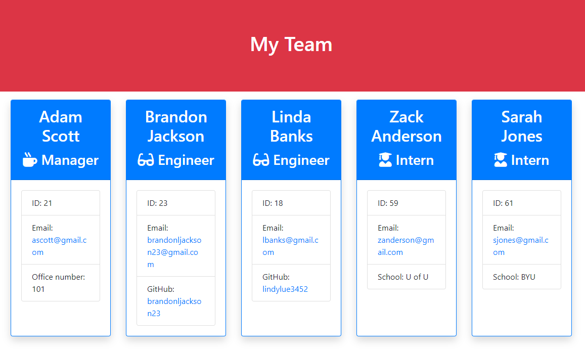

# Team Profile Generator

## DESCRIPTION
A tool that allows a user to create a simple webpage that displays a team profile from the command line.

---

## TABLE OF CONTENTS
[1. DESCRIPTION](#DESCRIPTION)  
[2. TABLE OF CONTENTS](#TABLE-OF-CONTENTS)  
[3. INSTALLATION](#INSTALLATION)  
[4. USAGE](#USAGE)  
[5. CONTRIBUTING](#CONTRIBUTING)  
[6. TESTS](#TESTS)  
[7. LICENSE](#LICENSE)
[8. DEMO VIDEO](#DEMO-VIDEO)  
[9. QUESTIONS](#QUESTIONS)  

---

## INSTALLATION
To run the tool you will need to clone the project files from my GitHub page at github.com/brandonljackson23. You will also need to install Node.js and the Inquirer package to run the command prompts.  Last, you will need to install Jest to run the tests.

---

## USAGE
The tool is intended to be used by any member of an organization who wishes to create a website to display their team.

---

## CONTRIBUTING
Currently, Brandon Jackson is the sole contributor to this tool.  If you wish to contribute please contact Brandon Jackson at the email listed below.

---

## TESTS
You will need to install Jest in order to run the tests.  Once you have Jest installed, navigate to the project in command line and enter 'npm run test'.

---

## LICENSE
This application is covered under the following license(s): None

---

## DEMO VIDEO
Click on the image below to watch a short demo video that illustrates how the tool works.

---

## QUESTIONS
If you have any questions please contact:  
|  Brandon Jackson  |  brandonljackson23@gmail.com  |  <https://github.com/brandonljackson23>  |
